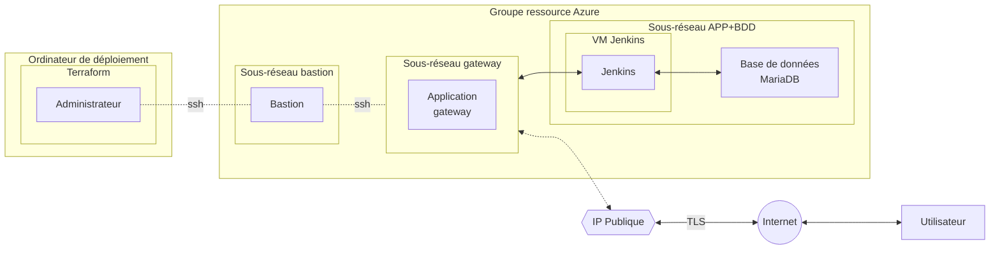

# Documentation Brief 4 Groupe 3
Celia, Paul, Raja

## Topologie

## Installation des prérequis

- [Terraform](https://www.terraform.io/downloads)
- Azure cli (**az login**)

## Terraform : documentation

Création et gestion de ressources de plateforme Cloud et autres services à l'aide de leurs interfaces de programmation d'application (API).

L'interface de lignes de commandes accepte un certain nombre de commandes (cf ``terraform -help``, exemple : ``terraform init``, ``terraform validate``. Pour voir de l'aide sur une commande, ex : ``terraform validate -help``)

Format : **fichiers .tf**
Pour pouvoir utiliser les fichiers, il faut lancer les commandes depuis le dossier où ils sont placés.
3 fichiers : providers.tf (plugins nécessaires pour communiquer avec les plateformes cloud, indiquent aussi les versions), variables.tf (définit les variables), main.tf (script principal)

## **[3 étapes](https://www.terraform.io/intro)**

### *Write* : Ecriture du code pour définir l'infrastructure à créer

**Dans providers.tf** : 

Les providers pour faire fonctionner le script sont déjà installés. Il est possible que des providers additionnels soient nécessaire.
Après chaque changement du fichier, il faut réinitialiser : **terraform init -upgrade**.

**Dans main.tf** : 

Déclaration de ressources, qui représentent les objets de l'infrastructure. Pour chaque ressource, un exemple type et une explication des arguments utilisés est disponible sur la [documentation terraform](https://registry.terraform.io/providers/hashicorp/azurerm/latest/docs) (*azurerm <infrastructure à installer>* dans la barre de recherche).
Exemple pour la [création du groupe ressource](https://registry.terraform.io/providers/hashicorp/azurerm/latest/docs/resources/resource_group) : 

resource "azurerm_resource_group" "example" {
  name     = "example"
  location = "West Europe"
}

Ceci correspond à la syntaxe : 

">BLOCK TYPE<" ">BLOCK LABEL<" ">BLOCK LABEL<" { ##Block body##
  
  ">IDENTIFIER<" = ">EXPRESSION<" ##Argument##
}

*"azurerm_resource_group"* est un bloc qui indique  à terraform le type d'infrastructure à créer. 
*"example"* est un bloc dont nous choisissons le nom qui aide à différencier les blocs d'infrastructure identiques : pour 2 subnets, on pourra construire par exemple *resource "azurerm_subnet" "subnet_vm"* et *resource "azurerm_subnet" "subnet_bastion"*.
      
**Dans variables.tf** : 
      
variable "resource_group_name" {
  default = "brief4_g3"
}
      
*"variable"* indique le nom qui est utilisé dans le script main.tf. *"default"* indique le nom qui s'affichera dans Azure.
Dans main.tf, on appelera les variables par **var.** : *var.resource_group_name*

**Attention**
      
Terraform construit toutes les ressources en même temps. Afin d'être sûr qu'une ressource ne soit pas créée avant une autre dont elle a besoin pour exister (ex : création de subnet avant la création du vnet), il faut appeler lors de la création d'une ressource une ou des ressources précédentes nécessaires. Cela donnera un certain ordre à la création de l'infrastructure.

Exemple : 

resource "azurerm_subnet" "subnet_vm" {
  name                 = var.subnet_vm
  **resource_group_name  = azurerm_resource_group.main.name**
  **virtual_network_name = azurerm_virtual_network.vnet.name**
  address_prefixes     = ["10.1.1.0/24"]
}
      
On utilise les blocs définis précédemment pour identifier la ressource qu'on appelle (*ex : azurerm_subnet.subnet_vm*), et on rajoute **.ce_qui_est_demandé**. Exemple : **.name**, **.id**, **.ip_adress**, etc.
      
*Pour vérifier que le langage utilisé dans le script est correct avant de commencer les étapes suivantes, on peut utiliser **terraform validate***

### *Plan* : plan d'exécution qui résume ce qui va être créé, modifié et détruit par rapport à ce qui a déjà été mis en place

``terraform plan``

### *Apply* : Applique le plan ("yes" pour valider)

``terraform apply``
      
*Pour détruire les ressources et recommencer à zéro : **terraform destroy***
      
**[Ici](https://learn.hashicorp.com/collections/terraform/aws-get-started) pour plus d'informations**
      
## Variables à modifier

*Tout est modifiable, mais nous présentons les variables concernées par un changement d'admin. Ces changements ne sont pas obligatoires.*    
      
### Dans variables.tf

- variable "admin" : **l.61**
- variable "mariadb_admin" : **l.89**
- variable "mariadb_password" : **l.93**
- variable "devops1/2/3" : **l.141 à 151**
- variable "email_devops1/2/3" : **l.161 à 171**
      
### Dans main.tf

- public_key file : **l.126**
      
### Dans cloud-init.yml

- Utilisateurs "name", "geco" et "ssh_authorized_keys" : **l.18 à 37**

## *Infrastructure minimale*
      
- Création d'un [groupe de ressource](https://registry.terraform.io/providers/hashicorp/azurerm/latest/docs/resources/resource_group) (*var.resource_group_name*)
- Création d'un [vnet](https://registry.terraform.io/providers/hashicorp/azurerm/latest/docs/resources/virtual_network) avec adresse privée 10.1.0.0/16 (*var.vnet_name*)
- Création de 3 [subnets](https://registry.terraform.io/providers/hashicorp/azurerm/latest/docs/resources/subnet) : **VM** (*var.subnet_vm*, 10.1.1.0/24), **bastion** (*var.subnet_bastion*, 10.1.2.0/24) et **gateway** (*var.subnet_gateway*, 10.1.3.0/24)
- Création de 2 [IP publiques](https://registry.terraform.io/providers/hashicorp/azurerm/latest/docs/resources/public_ip) : **bastion** (*var.ip_bastion*) et **gateway** (*var.ip_gateway*)
- Création d'un [bastion](https://registry.terraform.io/providers/hashicorp/azurerm/latest/docs/resources/bastion_host) (*var.bastion*)
- Création d'une [interface réseau](https://registry.terraform.io/providers/hashicorp/azurerm/latest/docs/resources/network_interface) (*var.VM-nic*)
- Création d'une [VM Linux Debian 11](https://registry.terraform.io/providers/hashicorp/azurerm/latest/docs/resources/linux_virtual_machine) (*var.VM_name*, 10.1.1.10) avec création d'un admin (*var.admin*) qui peut se connecter en SSH à l'aide de la clé publique (ligne 126)
- Connexion à la VM en SSH avec azure CLI : ``az network bastion ssh -n "bastion_brief4_g3" --resource-group "brief4_g3" --target-resource-id "/subscriptions/a1f74e2d-ec58-4f9a-a112-088e3469febb/resourceGroups/brief4_g3/providers/Microsoft.Compute/virtualMachines/VM_g3" --auth-type "ssh-key" --username "<admin>" --ssh-key "<path to ssh-key>"``
- Création d'un [groupe de sécurité réseau](https://registry.terraform.io/providers/hashicorp/azurerm/latest/docs/resources/network_security_group) (*var.NSG*) et ouverture des ports 22 et 80
- Création d'une [association](https://registry.terraform.io/providers/hashicorp/azurerm/latest/docs/resources/subnet_network_security_group_association) du groupe de sécurité réseau avec le subnet de la VM

## *Base de données*
      
- Création d'un [serveur MariaDB](https://registry.terraform.io/providers/hashicorp/azurerm/latest/docs/resources/mariadb_server) (*var.server_name*) avec login (*var.mariadb_admin*) et mot de passe (*var.mariadb_password*)
- Création d'une [base de données mariadb](https://shisho.dev/dojo/providers/azurerm/Database/azurerm-mariadb-database/) (*var.mariadb_name*)
- Création d'une [règle de firewall](https://registry.terraform.io/providers/hashicorp/azurerm/latest/docs/resources/mariadb_firewall_rule) (*var.mariadb_rule*)

## *Stockage*
      
- Création d'un [compte de stockage](https://registry.terraform.io/providers/hashicorp/azurerm/latest/docs/resources/storage_account) (*var.storage_name*)

## *Cloud-init*

- Avant la création de la VM, appeler le script cloud-init.yml (*[data "template_file"](https://registry.terraform.io/providers/hashicorp/template/latest/docs/data-sources/file)*, *[data "template_cloudinit_config"](https://registry.terraform.io/providers/hashicorp/template/latest/docs/data-sources/cloudinit_config)*)

### Dans cloud-init.yml
      
- Installation de 6 packages :  
  - ca-certificates 
  - curl
  - gnupg
  - lsb-release
  - certbot
  - default-mysql-client
- Ajout des utilisateurs
- Commandes dans la VM
    - Création d'un dossier pour les clés Docker et téléchargement des clés GPG Docker
    - Téléchargement et installation de Docker
    - Extraction de Jenkins
    - Précision des ports à utiliser

## *Gateway*

- Déclaration de variables locales
- Création du [gateway](https://registry.terraform.io/providers/hashicorp/azurerm/latest/docs/resources/application_gateway) (*var.gateway_name*), via les ports
- Création d'une [association](https://registry.terraform.io/providers/hashicorp/azurerm/latest/docs/resources/network_interface_application_gateway_backend_address_pool_association) entre l'interface réseau de la VM et le pool d'adresses du backend de la gateway
- Ajout d'une sonde personnalisée de manière à pouvoir accéder à la VM

## *Monitoring*
      
- Création d'un [espace de travail Log Analytics](https://registry.terraform.io/providers/hashicorp/azurerm/latest/docs/resources/log_analytics_workspace) (*var.log_name*)
- Création du [groupe d'action qui monitore](https://registry.terraform.io/providers/hashicorp/azurerm/latest/docs/resources/monitor_action_group) (*var.action_group_name*), avec login et adresse mail des personnes à contacter pour les alertes (*var.devops1/2/3, var.email_devops1/2/3, var.formateur1/2, var.email_formateur1/2*)
- Création d'une [alerte pour les diverses métriques](https://registry.terraform.io/providers/hashicorp/azurerm/latest/docs/resources/monitor_metric_alert) (*var.alert_name_vm*, *var.alert_name_db*, *var.alert_name_gateway*)

## *Backup de la base de données*
      
- Création du backup déjà effectuée : une des options de la ressource "azurerm_mariadb_server"
